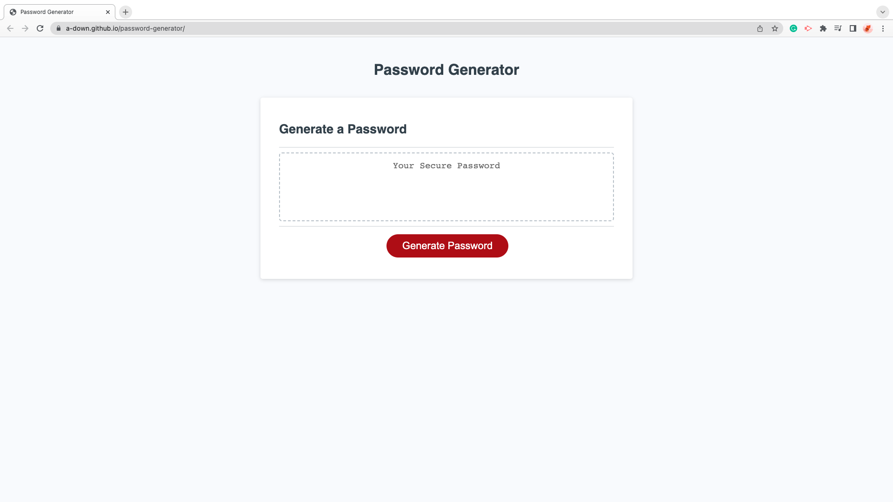

# Password Generator (Module 03 Homework - JavaScript)

The goal was to create the JavaScript Code for a Password Generator that satisfied these requirements:
- Clicking the button will generate a password according to aseries of prompts.
- The user is able to answer the prompts regarding password criteria.
- The user can choose a password length between 8 and 128 characters.
- The user can choose to have lowercase, uppercase, numeric, and/or special characters in their password.
- The password generator will confirm that as least one type of character is selected, or the prompts will be repeated.
- A password is generated to match the selected criteria.
- The generated password is displayed on the page.

 

## Visual Example

---

 

## Working Version

---

[Link to Deployed Version](https://a-down.github.io/password-generator/)